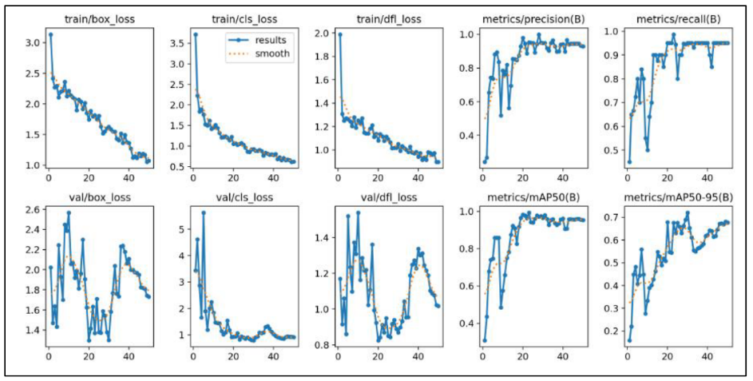
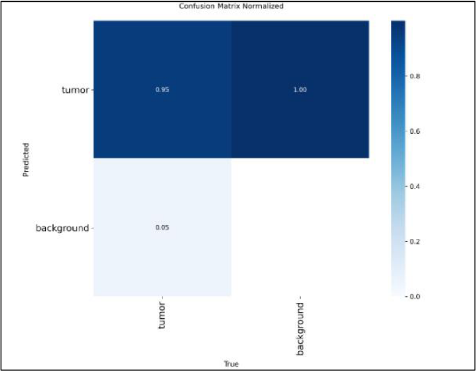

# 🧠 Brain Tumor Detection in Pediatric MRI

A complete computer vision pipeline that takes raw pediatric brain MRI scans and carries them through preprocessing, segmentation, feature-based classification, and deep-learning tumor detection — built on the **BraTS-PEDs** dataset.

Rather than jumping straight to a model, this project reconstructs the full classical-to-deep-learning CV pipeline: intelligent slice selection → noise filtering → edge-based segmentation → shape/texture feature extraction → unsupervised labeling → supervised classification → YOLOv8 detection.

> Group project for a Computer Vision course (BSAI-F-23-A) with [Zara Zaman](https://github.com/zaraazaman), under Ma'am Hina Rashid.

---

## Results

| Metric | Score |
|---|---|
| Tumor detection true positive rate | **~95%** |
| False negative rate | ~5% |
| Precision (B) | ~0.95–0.98 |
| Recall (B) | ~0.95–0.97 |
| mAP50 (B) | ~0.90–0.95 |
| mAP50-95 (B) | ~0.65–0.70 |

<p align="center">
  
</p>

<p align="center">
  
</p>

**Reading the confusion matrix:** the model correctly detects tumors in 95% of slices that contain one (5% false negatives). The "100%" on background isn't a red flag — object detection has no true-negative count (infinite empty space a model could theoretically draw a box in), so any background mistake shows as 100% of the *mistakes shown*, not 100% of all background regions.

---

## Dataset

**BraTS-PEDs** (Brain Tumor Segmentation – Pediatric): 25 patients, each with a 3D MRI volume across 4 modalities plus a segmentation mask:

- **T1n** (native)
- **T1c** (contrast-enhanced)
- **T2w** (weighted)
- **T2-FLAIR** — the modality actually used for tumor localization, since it highlights tumor regions most clearly

---

## Pipeline

The project is structured as four stages, each consuming the previous stage's output.

### 1. Image Preprocessing
- **Slice selection**: automated search across the 155 axial slices per patient, excluding face/neck and scalp artifacts, selecting the slice with highest intensity variance meeting a brain-coverage threshold
- **Bit-depth detection**: confirmed all scans are 16-bit — critical to avoid false contouring (treating an 8-bit image as 16-bit creates fake edges)
- **Filtering**: mean, median, and Gaussian filters (3×3 kernel) compared via **PSNR** and **SSIM**; median filter won on both metrics
- **Anti-aliasing downsampling**: 240×240 → 120×120 with a Gaussian pre-filter to avoid checkerboard artifacts from naive downsampling

### 2. Segmentation & Boundary Analysis
- **Edge detection**: Canny vs. Sobel — Canny produced cleaner, more precise boundaries and was kept as the primary mask
- **Morphological processing**: edge thickening + binary closing (structuring element radius 2) to bridge boundary gaps without expanding the tumor region
- **Chain coding**: 8-chain code boundary representation, made rotation-invariant via first-difference; shape number computed from the smallest circular permutation
- **Convex hull**: computed per tumor region — irregular hulls indicate spread-out, irregular tumors; smooth hulls indicate regular, contained ones

### 3. Feature Extraction & Classification
- **GLCM texture features**: pixel values quantized to 16 gray levels (necessary since MRI is 12–16 bit and full 256-level GLCM would be too sparse); extracted energy, contrast, entropy
- **Geometric features**: area, circularity
- **K-means (k=2)** clustering on normalized features to assign labels (no ground truth available) — high entropy + low circularity → malignant; low entropy + high circularity → benign
- **KNN (k=3)** trained on these pseudo-labels, evaluated via accuracy, precision, recall, F1

### 4. YOLOv8 Tumor Detection
- Masks converted to YOLO-format bounding boxes (normalized center-x, center-y, width, height)
- **YOLOv8s**, fine-tuned from pretrained weights, 50 epochs, image size 128, batch size 8
- Cosine LR schedule from 0.01, box loss weight 7.5, classification loss weight 0.5
- 80/20 train/test split

---

## Tech Stack

`Python` `OpenCV` `NumPy` `scikit-learn` `Ultralytics YOLOv8` `scikit-image`

---

## Setup & Usage

```bash
# Clone the repo
git clone https://github.com/lizaasad04/CV-project-Brain-tumor-localization-with-YOLO.git
cd CV-project-Brain-tumor-localization-with-YOLO

# Create a virtual environment
python -m venv venv
source venv/bin/activate  # On Windows: venv\Scripts\activate

# Install dependencies
pip install -r requirements.txt
```

Run the pipeline stages in order (adjust script/notebook names to match your repo structure):

```bash
python preprocessing.py       # Assignment 1: slicing, filtering, downsampling
python segmentation.py        # Assignment 2: edge detection, morphology, chain coding
python classification.py      # Assignment 3: GLCM features, K-means + KNN
python train_yolo.py          # Assignment 4: YOLOv8 training + evaluation
```

> **Note:** Add a `requirements.txt` if you don't already have one, listing exact package versions — this makes the repo actually runnable for anyone who clones it.

---

## Repo Structure

```
├── preprocessing.py
├── segmentation.py
├── classification.py
├── train_yolo.py
├── assets/
│   ├── training_curves.png
│   └── confusion_matrix.png
├── Final_Report.md
└── README.md
```

---

## References

1. Ali, A., Li, X., Mashwani, W.K. et al. Computer vision based efficient segmentation and classification of multi brain tumor using computed tomography images. *Sci Rep* 15, 32198 (2025).
2. A. M. Alm and S. S. Abu-Naser, "Detection of Brain Tumor Using Deep Learning," *International Journal of Academic Engineering Research (IJAER)*, vol. 6, no. 3, pp. 29–47, 2022.

---

## 🔭 Future Work

- Expand to a larger, more diverse pediatric dataset
- Explore full 3D volume-based detection instead of single-slice
- Replace K-means pseudo-labels with expert-annotated ground truth for the benign/malignant classification step
